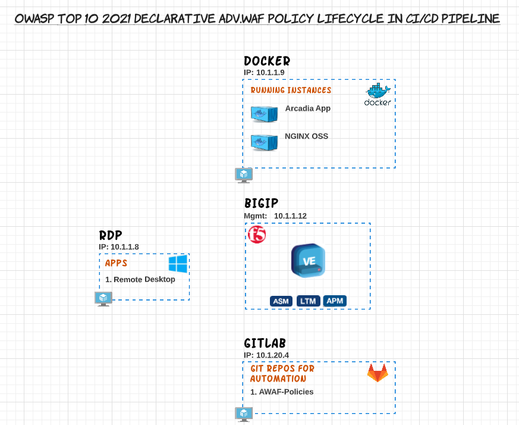

Warsaw, Welcome to the ForceFor Lab Guide
#######################################################################

The intention of the Lab Guide is to provide you with helpful content to run trough the Lab on your own pace.
The Lab Guide is not providing a step-by-step exercise as well cover the overall concept of the Lab as well as the path trough the Lab during our session.

A high level diagram for "OWASP Top 10 2021 Declarative AWAF policy lifecycle in CI/CD Pipeline" environment can be found below along with the technologies that are being used on this lab.

**What's the goal of the Lab?**

The goal of the Lab is to understand how a deplyoment of an initial Security Policy Deployment can be automated with the help of GitLab.

In GitLab you start creating a basic policy based on a Rapid Deployment Policy Template with the help of GitLab and push this out to AWAF.

You then enhance the Security Policy in a way to finally got an OWASP Top 10 for 2021 compliant declarative WAF policy for BIG-IP.

Dev Central Article: https://community.f5.com/t5/technical-articles/how-to-deploy-a-basic-owasp-top-10-for-2021-compliant/ta-p/295346

	
To deploy a solution you must be logged into UDF (https://udf.f5.com).

F5ers can access the blueprint directly from UDF without launching a course. 

.. note:: 	If a given topic is not highlighted currently on this page or something is incorrectly documented, please send a Teams Chat to Patrick Zoller.
         	We will do our best to prioritize the development of the content based on demand.

.. toctree::
   :maxdepth: 2
   :caption: Contents:
   :glob:

   environment*/*
   class*/class*